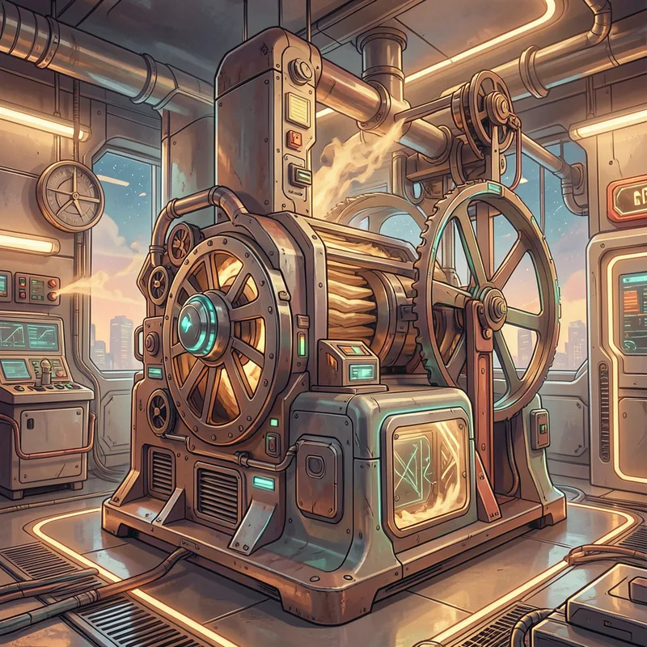

# mill

<p align="center">
  
</p>

**Grain goes in, flour comes out, and the machinery doesn't improvise.**

The mill is frostyard's answer to a specific problem: coding agents are
genuinely good at writing software now, but *using* them is still guesswork.
You hand an agent a big piece of work and get back a big pile of plausible
changes — and now you're the one holding the bag: Did it cover the whole
spec, or the parts it found interesting? Did the tests actually run, or did
it *say* they ran? Did it quietly touch things it shouldn't have? Every
answer costs you a careful read of everything it did, which was the work you
were trying to delegate in the first place. When something goes wrong
mid-task, the agent decides on its own what to do about it — retry, wander
off-plan, declare victory — and by the time you look up, an hour of tokens
has been spent painting a hallway you didn't ask for.

The fragility isn't in the models. It's in handing one model the job, the
grading of the job, and the decision about when to stop — all in one
context, with no adversary and no referee.

The mill splits those roles apart and gives each one to the party that's
actually good at it:

- **Scripts referee.** Every loop, counter, gate, and git operation is
  deterministic code. An LLM never decides whether tests passed, when to
  stop retrying, or what gets committed — a script does, and its answer
  doesn't depend on a model's mood. If `make test` is red, no amount of
  eloquence ships the chunk.
- **A rival model grades.** The model that writes the code never grades its
  own homework. A different vendor's model — prompted to *reject*, not to
  assist — reviews the plan, every chunk, and finally walks the spec
  requirement by requirement, producing a met/unmet matrix with file:line
  evidence. Two models with different blind spots have to agree before
  anything counts.
- **You decide the irreversible things.** The run pauses at exactly two
  moments: before implementation starts (is this plan what you meant?) and
  before anything leaves the machine (does this ship?). Everything between
  runs unattended, in an isolated worktree that can't touch your checkout.
- **Every run makes the next one smarter.** Friction — failed gates,
  reviewer objections, revision loops — is journaled, distilled into small
  written lessons, committed inside the same PR for human review, and read
  by every future run. Mistakes get made once, then become policy.

The result: you hand the mill a complete specification and get back either a
branch where every requirement is evidenced, every gate is green, and the
review trail is written down — or an honest, early, bounded failure telling
you exactly which assumption broke. Both outcomes are cheap to act on.
That's the trade the mill makes everywhere: it spends tokens freely to
verify, so you don't spend attention to trust.

## How it works

A complete specification (a GitHub issue or a markdown file) goes through
the mill using [microsoft/conductor](https://github.com/microsoft/conductor):


The engine is generic. Everything repo-specific — gate commands, context
docs, security invariants, harvest allowlist — lives in a committed
`.mill.toml` in each consuming repository (see `mill.toml.example`).

## Design rules

- **The spec is validated before anything else** — a rival model checks it
  against source truth for grounding, contradictions (universal invariants
  need transition rules), ambiguity, and convergible scope, escalating to a
  human before any planning spend.
- **All control flow is deterministic.** Loop counters, gate results, and
  every git operation live in `mill_state.py`; LLM steps never decide when a
  loop ends and never run git. Bounded retries everywhere; exhaustion
  terminates with a resumable checkpoint instead of thrashing.
- **LLM output shapes can't kill a run.** Reviewers reply in free text
  ending with a JSON block; deterministic gates normalize it
  (rejection-biased when unparseable).
- **Cross-model adversarial review.** Claude implements; GPT (via the
  Copilot provider) reviews the plan, each chunk, and final spec compliance
  with a requirement-by-requirement matrix.
- **Reviewers are provably read-only** — staged-diff hash compared around
  every review; tampering is reverted and aborts the run.
- **Self-improvement.** Friction is journaled; a harvest step distills
  durable lessons into the repo's skills directory, committed inside the
  same PR, and read by every future run (and every other agent, via the
  cross-agent links millify creates).
- **Worktree isolation.** `mill.sh` runs conductor inside
  `.worktrees/mill-<id>`; the main checkout is never touched.
- **Humans gate the irreversible moments**: plan approval and ship.
- **Runs are isolated and composable** — worktree, branch, run state, and
  dashboard port per run; the driver refuses a second run in the same
  worktree. Run several at once (one per phase, or per project), as long as
  the repo's own tests avoid fixed host ports and paths.

## Install

```sh
curl -sSfL https://raw.githubusercontent.com/frostyard/mill/main/install.sh | sh
```

Prerequisites: [conductor](https://github.com/microsoft/conductor) with the
`claude-agent-sdk` extra (auth via `claude login`) and the Copilot provider
(auth via `gh auth login`):

```sh
curl -sSfL https://aka.ms/conductor/install.sh | sh
uv tool install --force 'conductor-cli[claude-agent-sdk] @ git+https://github.com/microsoft/conductor.git@v0.1.25'
```

(Do not install `conductor-cli` from PyPI — that's an unrelated package.)

## Set up a repository

In Claude Code, run the `millify` skill in the target repo — it inspects the
build system, generates `.mill.toml`, seeds the skills directory, and wires
the cross-agent surfaces (`CLAUDE.md`, `.github/copilot-instructions.md`,
`.agents`, `GEMINI.md` → all reading the canonical `AGENTS.md`). Or copy
`mill.toml.example` to `.mill.toml` and edit by hand.

## Run

```sh
mill 35                    # run issue #35, interactive gates
mill 35 --no-pr --web      # background run with a live web dashboard
mill spec.md --auto        # unattended (auto-approves gates)
mill 35 --no-pr --no-deep  # local-only, fast gates
```

`--web` gives you conductor's real-time dashboard — the pipeline as a live
graph with streaming agent output, and human gates you answer in the
browser.

First run on a new repo: use interactive gates and `--no-pr`, and
sanity-check the plan at the approval gate.

Run state lives in `.mill/` inside the worktree (spec, plan, progress,
journal, final report). Resume a stopped run with `conductor resume` from
the worktree; the plan and completed chunks are preserved.
